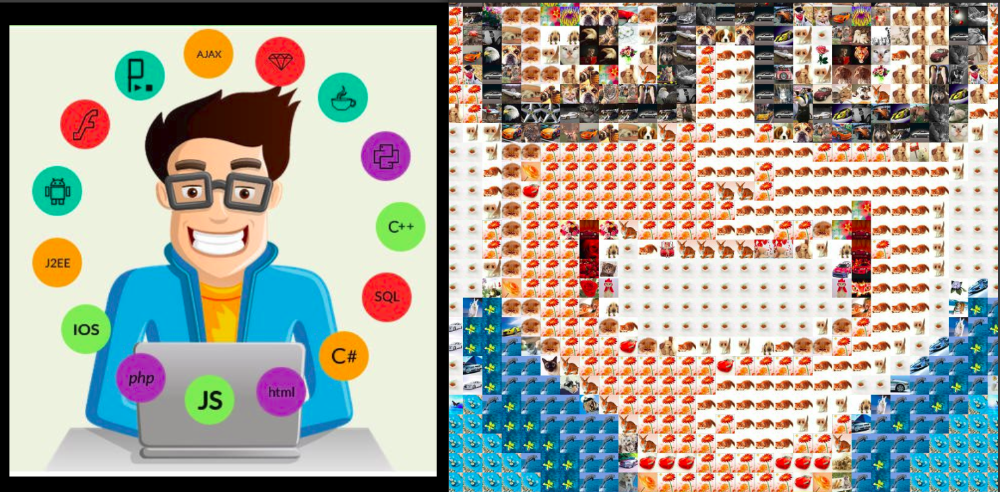
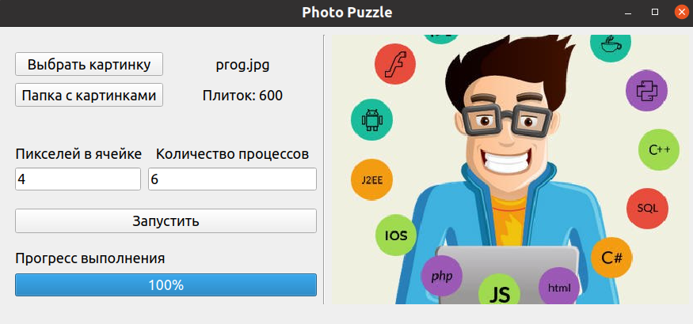
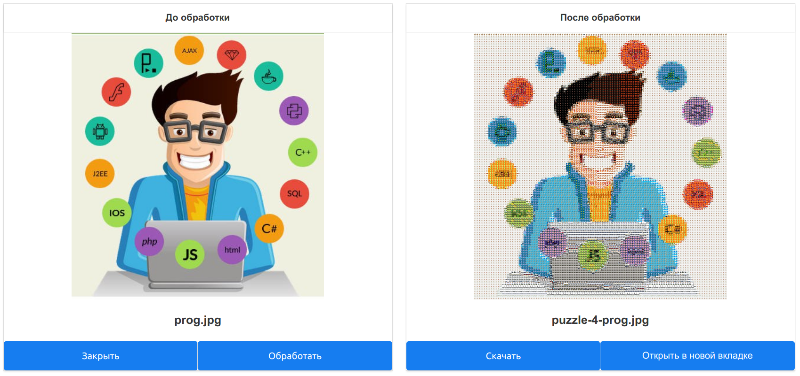

# Photo Puzzle

На основе загруженного изображения создает новое изображение, состоящее из заранее подготовленных плиток (мелких картинок).
Плитка подбирается таким образом, чтобы наилучшим образом соответствовать среднему цвету,
вычесленному для квадратной области из пикселей указанной длины.



Процесс генерации изображения может быть распараллелен на несколько процессов при помощи модуля `multiprocessing`,
что значительно ускоряет генерацию изображения.

Интерфейс реализован 2-я способами.

## Desktop-приложение
Использованные технологии: PyQt.



Приложение поддерживает настройку длины квадратной области в пикселях и количества процессов для распараллеливания.
Кроме этого можно указать папку с плитками, из которых будет составлено изображение (в папке tiles находятся 2 
подготовленных набора таких плиток). По мере генерации изображения прогресс выполнения отображается в прогресс-баре.

Для запуска воспользоваться командой:
```bash
python3 ./mosaic/source.py
```

## WEB-приложение
Использованные технологии: Flask + Vue.JS.



На данный момент приложение поддерживают только загрузку исходного и скачивание готового изображения.
Генерация происходит с предустановленными параметрами.

Для запуска сервера воспользоваться командой:
```bash
python3 main.py
```
Для запуска клиента:
```bash
cd client
npm run start
```